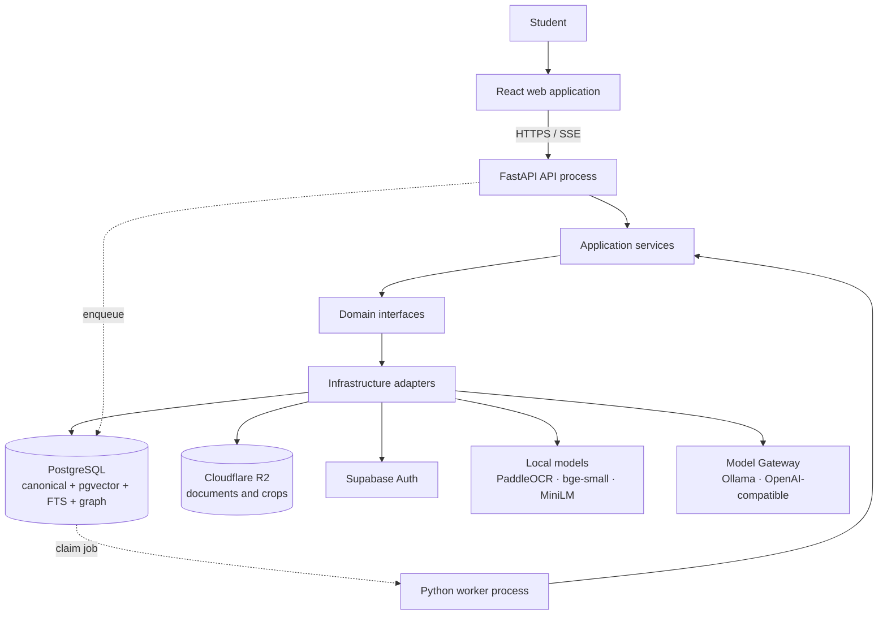
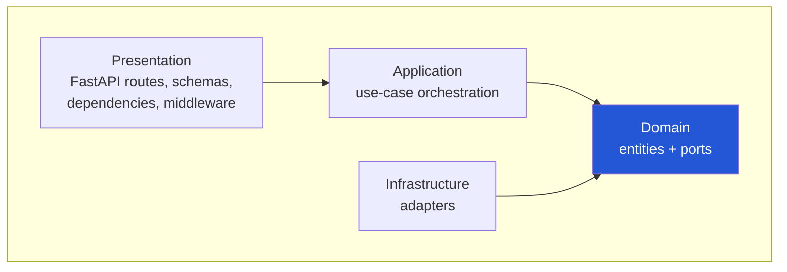
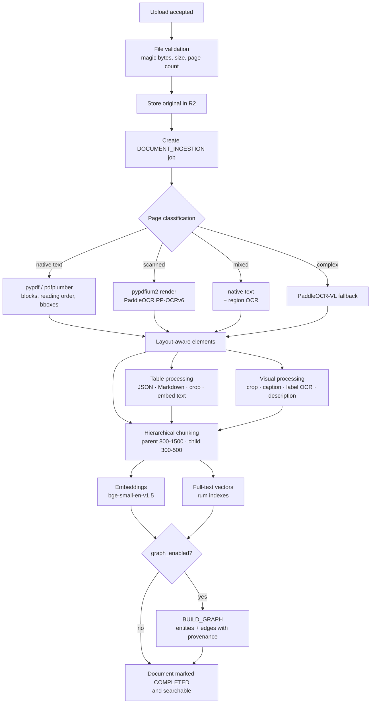
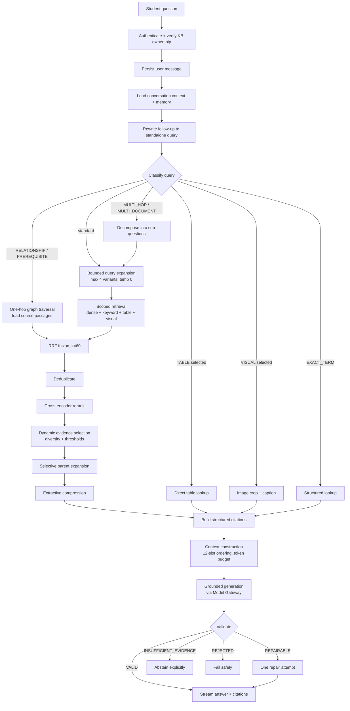
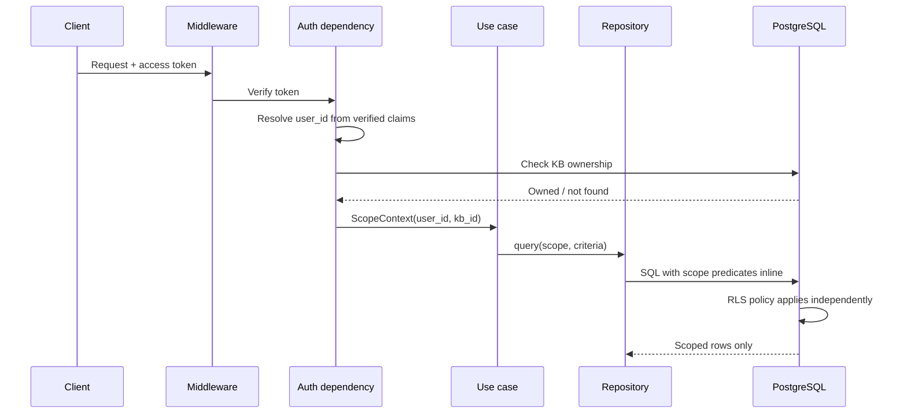
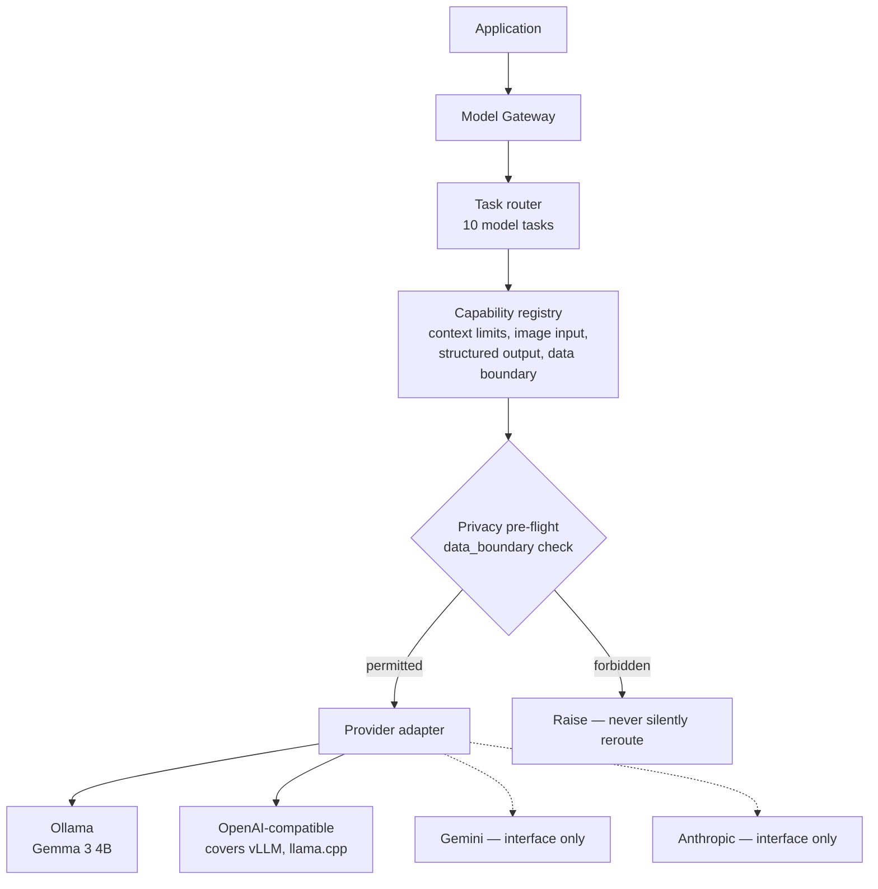

# Architecture

How the Multimodal Educational Tutor RAG platform is structured, why, and what the boundaries are.

Requirement IDs referenced here are defined in [REQUIREMENTS.md](REQUIREMENTS.md). Decisions are
recorded in [PLAN.md](PLAN.md) and expanded in [docs/adr/](docs/adr/).

> **The central rule.** PostgreSQL preserves the truth, retrieval assembles the evidence, the model
> explains it, and validation determines whether the explanation is safe to return.

---

## 1. Design principles

Five principles govern every structural decision. They are the tie-breakers when a phase presents a
choice.

### 1.1 Knowledge Base isolation

A Knowledge Base is the organizational, retrieval **and security** boundary — not merely a folder.

Every scoped record carries `user_id` and `knowledge_base_id`: documents, pages, elements, chunks,
embeddings, tables, visual objects, graph entities and relationships, conversations, messages,
memories, summaries, quizzes, flashcards, study plans, progress records and cached results.

This is enforced in three independent places, so a failure in one does not become a breach:

| Layer | Mechanism |
|-------|-----------|
| Database | Row-Level Security policies on every scoped table |
| Repository | A query cannot be constructed without a `ScopeContext` |
| Application | Ownership verified before the request reaches a use case |

`NFR-SEC-01`, `NFR-SEC-02`, `NFR-SEC-03`.

### 1.2 Canonical data and derived indexes

PostgreSQL is the single source of truth. Everything else is derived and disposable:

```
pgvector indexes · full-text indexes · graph projection
conversation summaries · embeddings · caches
```

Derived data must be **rebuildable**, and rebuildability is proven by a test rather than assumed
(`NFR-DAT-02`). This is what makes it safe to drop and recreate an index, change an embedding
model, or defer Neo4j entirely.

### 1.3 Retrieve broadly, filter aggressively

Recall and precision are separated into distinct stages:

```
Broad retrieval → RRF fusion → cross-encoder reranking
→ coverage-aware selection → context compression
```

**The number of retrieved candidates is not the number of chunks sent to the model.** 40–60
candidates enter; 1–8 evidence items leave (`FR-RET-11`, `FR-EVD-04`).

### 1.4 Evidence before generation

The model does not decide what it is authorized to read. Authorization, filtering, retrieval and
citation construction all complete **before** the model is invoked. The model receives an evidence
set it cannot expand.

### 1.5 Validation after generation

An answer is not returned because it looks plausible. It is checked for citation validity, citation
authorization, claim support, contradictions, numerical accuracy, schema correctness and scope
leakage. A failed answer gets exactly one repair attempt (`FR-VAL-06`, `NFR-REL-04`).

---

## 2. High-level architecture

A modular monolith with clean/hexagonal architecture. Two processes share one codebase.



The API and worker run as **separate processes sharing the same domain and application code**, so
ingestion never blocks chat (`FR-JOB-09`). They communicate only through the job table in
PostgreSQL — there is no direct call path between them.

---

## 3. Runtime processes

### 3.1 React frontend

Authentication, Knowledge Base management, uploads, chat, streaming display, PDF viewing, citation
navigation, table and figure selection, concept graph, quizzes, flashcards, study plans, memory
controls.

### 3.2 FastAPI API process

REST endpoints, authentication and authorization, interactive retrieval, RAG orchestration,
streaming responses, conversation management, Knowledge Base CRUD, generated-content operations,
validation and observability.

### 3.3 Python worker process

PDF processing, OCR, table extraction, visual extraction, embedding generation, graph extraction,
graph synchronization, conversation compaction, summary rebuilding, deletion jobs.

Jobs are claimed with `SELECT … FOR UPDATE SKIP LOCKED`, ordered by priority then creation time.
`INTERACTIVE` work outranks OCR, graph building and bulk compaction (`FR-JOB-05`, `FR-JOB-06`).

---

## 4. Layers and the dependency rule



**Dependencies point inward.** The domain is the centre and depends on nothing. Infrastructure
depends on the domain by implementing its ports — never the reverse.

### 4.1 What belongs where, and what must not

| Layer | Contains | Must not contain |
|---|---|---|
| **Presentation** | Routes, request/response schemas, auth dependencies, middleware, streaming endpoints, error mapping | Retrieval logic, OCR, provider-specific code, SQL |
| **Application** | Use-case orchestration: `CreateKnowledgeBase`, `UploadDocument`, `ProcessDocument`, `AskQuestion`, `GenerateSummary`, `GenerateQuiz`, `CreateStudyPlan`, `RetrieveConceptGraph`, `CompactConversationMemory`, `DeleteKnowledgeBase` | Framework types, SQL, vendor SDK calls |
| **Domain** | Entities, value objects, enums, ports, domain rules | FastAPI, SQLAlchemy, Neo4j drivers, provider SDKs, HTTP clients, file I/O |
| **Infrastructure** | Repositories, storage, retrievers, parsers, OCR, embeddings, reranking, model providers, cache, observability | Business rules, use-case sequencing |

The domain restriction is enforced by an automated import-boundary test, not by review
(`NFR-MNT-01`). A violation fails the suite.

### 4.2 Domain entities

`KnowledgeBase` · `Document` · `DocumentElement` · `Chunk` · `Evidence` · `Citation` ·
`Conversation` · `MemoryFact` · `GraphEntity` · `GraphRelationship` · `RetrievalPlan` ·
`ModelRequest` · `ModelResponse` · `ProcessingJob`

### 4.3 Ports and adapters

Every port is defined in the domain and implemented in infrastructure. Swapping an adapter is a
configuration change; no caller is aware.

| Port | Adapter | Phase |
|---|---|---|
| `KnowledgeBaseRepository`, `DocumentRepository`, `ChunkRepository`, `ConversationRepository`, `MemoryRepository`, `GraphRepository`, `JobRepository` | SQLAlchemy + psycopg | 2 |
| `StoragePort` | Cloudflare R2, S3-compatible presigned URLs | 4 |
| `PdfParserPort` | pypdf · pdfplumber · pypdfium2 | 5 |
| `OcrPort` | PaddleOCR PP-OCRv6, PaddleOCR-VL fallback | 5 |
| `EmbeddingPort` | `BAAI/bge-small-en-v1.5` | 7 |
| `DenseRetriever` | pgvector HNSW | 9 |
| `KeywordRetriever` | PostgreSQL full-text search with `rum` | 9 |
| `RerankerPort` | `cross-encoder/ms-marco-MiniLM-L6-v2` | 9 |
| `GraphPort` | PostgreSQL traversal — Neo4j deferred | 12 |
| `ModelGatewayPort` | Ollama · OpenAI-compatible | 8 |
| `CacheStore` | PostgreSQL, `UNLOGGED` | 16 |
| `ObservabilityPort` | Structured logging + `model_invocations` | 3 |

`GraphPort` is expressed in **traversal terms** — `neighbors(entity, depth, types)`,
`subgraph(seed, max_nodes)` — never in a vendor query language, so a graph database can be
introduced later without touching a single caller (`NFR-POR-03`).

---

## 5. Data flows

### 5.1 Ingestion



Page renders produced for OCR are written to a **TTL cache prefix**, not permanent storage — they
are regenerable from the original (D-13, `FR-ING-19`, `NFR-CAP-03`).

Nothing is retrievable until the document reaches `COMPLETED` (`FR-IDX-09`).

### 5.2 Query



An exact-answer cache is consulted after classification and before expansion; its key includes
conversation state, index version, prompt version and model, so a stale or cross-scope hit is not
representable (`FR-CCH-03`, `NFR-SEC-08`).

### 5.3 Scope enforcement



Three independent gates. The repository cannot be called without a `ScopeContext`, the SQL carries
the predicate inline, and RLS enforces it again at the database. Filtering happens **before**
ranking or traversal, never after (`NFR-SEC-02`).

---

## 6. Storage responsibilities

As specified in §60, amended by D-08 and D-13.

| Store | Holds | Notes |
|---|---|---|
| **PostgreSQL** | Canonical structured data, messages, memories, graph entities and relationships, processing state, generated-content metadata, evaluation records | Single source of truth |
| **pgvector** | Document chunk embeddings, memory embeddings, episode embeddings | Derived · HNSW · always queried with metadata filters |
| **PostgreSQL FTS** | Lexeme vectors for exact terminology, identifiers and keyword matching | Derived · `rum` indexes (D-12) |
| **Cloudflare R2** | Original documents, table crops, figure/chart/diagram crops, generated exports | Private bucket · signed URLs only (D-08) |
| **R2 cache prefix** | Page renders | **Regenerable** · TTL-bounded · not canonical (D-13) |
| **Graph store** | Entities and relationships | Canonically in PostgreSQL; a projection is optional and rebuildable (D-10) |

### 6.1 Permanent versus regenerable

The distinction is deliberate and load-bearing for capacity (`NFR-CAP-01`, `NFR-CAP-02`):

| Permanent | Regenerable |
|---|---|
| Original document | Page renders |
| Table and figure crops — §18 requires re-sending the real crop to the multimodal model | Embeddings, full-text vectors |
| Canonical rows | Graph projection, caches, summaries |

Anything regenerable may be deleted at any time without data loss. Anything permanent is protected
by the deletion flow's ordering.

---

## 7. Model Gateway

All model execution passes through one boundary. No business logic calls a provider SDK.



Three properties matter most:

- **Internal model keys.** Application code names `default_text_model`, not `gemma3:4b`. Provider
  model names live only in configuration (`FR-MDL-12`, `NFR-MNT-03`).
- **Privacy is pre-flight.** The boundary check happens before the prompt is built, and a forbidden
  combination raises. There is no silent local-to-external fallback (`FR-MDL-17`, `NFR-PRV-02`).
- **Fallback is explicit.** Capability check → call → retryable classification → one retry →
  approved fallback. Every fallback is logged (`FR-MDL-18`, `FR-MDL-21`).

---

## 8. Versioning

Four independent version axes let derived data be rebuilt without downtime and let cached results
be invalidated precisely.

| Version | Changes when | Effect |
|---|---|---|
| `embedding_version` / `active_index_version` | Embedding model or dimension changes | Reindex; queries pin one version and never mix |
| `graph_version` | Graph extraction re-runs | Traversals pin one version |
| `prompt_version` | A prompt template changes | Recorded per message; invalidates answer cache |
| `generation_policy_version` | Validation or generation rules change | Invalidates answer cache |

All four participate in the answer cache key, alongside `conversation_state_hash`, so a cached
answer cannot survive a change that would alter it (`FR-CCH-03`).

---

## 9. Scaling path

Per §67. Each step is taken **only when measurement justifies it**, never pre-emptively.

| Stage | Trigger | Action |
|---|---|---|
| Initial | — | React · FastAPI · one worker · PostgreSQL · R2 · local Ollama |
| Higher ingestion load | Job queue depth persistently non-zero | Add background workers. The `SKIP LOCKED` queue scales horizontally with no code change. |
| Higher inference concurrency | Model queue time dominates latency | Move the gateway to a dedicated inference server with continuous batching, request scheduling, KV-cache management and backpressure. The `ModelGatewayPort` boundary makes this an adapter swap. |
| Larger conversation storage | `messages` growth degrades query plans | Enable partitioning via **`pg_partman`**. Tables are designed partition-ready from Phase 2 (D-15, `NFR-CAP-07`). Then hot/warm/cold tiering and archived transcripts. |
| Deeper graph traversal | Evaluation shows one hop is insufficient | Implement the Neo4j adapter behind the existing `GraphPort` (D-10). |
| Actual cache pressure | Measurement shows PostgreSQL or application memory insufficient | Only then introduce Redis. Not before (§4, `FR-CCH-06`). |
| Microservice split | Operational load justifies it | Candidate boundaries: interactive RAG, document processing, model gateway. |

---

## 10. Decision index

| ADR | Decision |
|---|---|
| ADR-001 | No PyMuPDF — licensing |
| ADR-002 | Self-hosted PaddleOCR, not Baidu Cloud OCR |
| ADR-003 | No LangChain / LangGraph / LlamaIndex |
| ADR-004 | Selective, not global, GraphRAG |
| ADR-005 | PostgreSQL as job queue and cache, not Redis |
| ADR-006 | Modular monolith, not microservices |
| ADR-007 | HyDE disabled by default |
| ADR-008 | Graph extraction opt-in per Knowledge Base |
| ADR-009 | Provider-agnostic model gateway |
| ADR-010 | One-hop initial traversal depth |
| ADR-011 | Local model quantization benchmark |
| ADR-012 | PostgreSQL graph adapter, Neo4j deferred |
| ADR-013 | Cloudflare R2 over Supabase Storage |
| ADR-014 | Page renders as regenerable cache |
| ADR-015 | `rum` over GIN for full-text indexes |

---

## 11. What this architecture deliberately is not

| Not | Why |
|---|---|
| Agentic | Orchestration is deterministic. Query routing is rule-based, not model-decided (`FR-QRY-04`). |
| Framework-mediated | No LangChain, LangGraph or LlamaIndex. The pipeline carries substantial custom security, multimodal, graph and citation behaviour that a generic framework would obscure. |
| Graph-first | Graph RAG is one retrieval path among several, selected by classification — never the default retriever (`FR-RET-12`). |
| Microservices | A modular monolith with clean boundaries. The boundaries exist so services *could* be split later; they are not split now. |
| Containerised | Development and deployment run without Docker, by constraint. |
